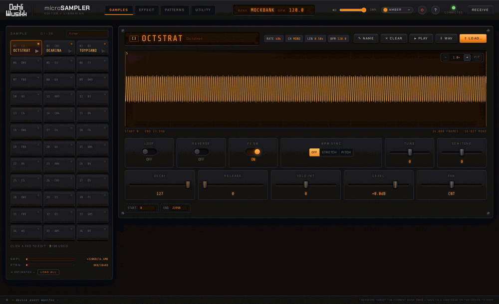
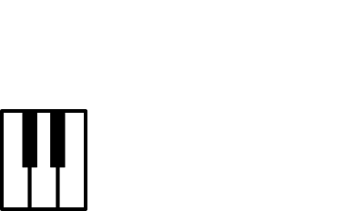

# microSAMPLER Editor / Librarian


A modern editor/librarian for the **Korg microSAMPLER**, replacing Korg's original 32-bit application (PPC/i386) that no longer runs on macOS 10.15+.
The hardware protocol was reverse-engineered from the original binary and verified against a real device.
This app covers everything the original did, plus a few things it didn't.



## Features

- **SAMPLES**:
  - 36-slot bank overview
  - Audition on the device (honors start/end points) with a playhead on the waveform
  - WAV download/upload (auto-resample to 48/24/12/6 kHz); drop several WAVs
    onto the pads to bulk-fill consecutive slots
  - Audio tools on upload — normalize, gain, trim silence, fade in/out,
    mono ↔ stereo (processed in-browser before transfer)
  - Filter pads by name
  - Live editing of all sample parameters
  - Draggable START/END markers on the waveform
  - Zoomable / pannable waveform (scroll to zoom, drag to pan) for
    sample-accurate trimming
  - Renaming banks and samples
  - Device memory meters
- **EFFECT**:
  - All 22 effect types with their full parameter sets
  - The two assignable FX knobs (panel knob movements tracked live)
  - Conditional parameter graying/swapping exactly like the hardware
- **PATTERNS**:
  - Receive all 16 patterns
  - Mini piano-roll preview + play patterns on the device (per-pattern ▶)
  - Import and Export MIDI files
- **UTILITY**:
  - Full bank backup/restore (RAM or persistent user banks)
- **Live two-way sync**:
  - Panel edits on the device show up in the app instantly

## Requirements

- macOS (tested), Linux (should work) or Windows (untested)
- Python 3.8+ with [pyusb](https://github.com/pyusb/pyusb) (BSD): `pip3 install pyusb`
- [libusb](https://libusb.info/) (LGPL): `brew install libusb`
- Chrome/Chromium recommended (any modern should work)
- A Korg microSAMPLER connected with USB

## Run

**macOS:** double-click **`microSAMPLER Editor Librarian.command`**.
It starts the bridge (asks for your password; root is required to claim the USB interface from CoreMIDI) and opens the editor window automatically.

### Manual / other OS

```bash
sudo python3 native-tools/bridge.py
```

Then open http://localhost:8765

### UI development without hardware

```bash
python3 native-tools/bridge.py --mock
```

Bank backups land in `native-tools/backups/` (gitignored, they're your data).
Note that sample/parameter transfers target the device's **current bank (RAM)**; save on the device or restore to a user bank to persist.

## Repository layout

```text
microSAMPLER Editor Librarian.command   double-clickable launcher (macOS)
web-editor/                   the browser app (served by the bridge)
native-tools/                 Python bridge + CLI tools (libusb USB-MIDI):
  bridge.py                     HTTP/SSE server the app talks to
  download.py / upload.py       single-sample transfer CLIs
  bank.py                       full-bank backup/restore CLI
  msusb.py                      transport + diagnostics (inquiry/monitor/…)
  protocol.py                   Korg SysEx/bulk protocol (offline self-test)
  test_*.py                     offline regression suite (mock device)
tools/re/                     reverse-engineering toolkit (needs the original
                              Korg installer, not included) — regenerates
                              web-editor/js/fxData.js etc.
tools/make_app_icon.sh        give the launcher its icon (run once, macOS)
```

## Development

See [ARCHITECTURE.md](ARCHITECTURE.md) for how the bridge, browser app, and
device fit together, and [CONTRIBUTING.md](CONTRIBUTING.md) to get started.

Run the offline test suite (no hardware needed):

```bash
cd native-tools
python3 protocol.py && python3 test_download.py && python3 test_upload.py \
  && python3 test_bank.py && python3 test_bridge.py
```

JavaScript unit tests for the pure modules (audio DSP + value encoders), via
Node's built-in test runner (no deps):

```bash
npm test        # node --test test/*.test.mjs
```

The app needs **no build step** to develop or run — it's plain ES modules and per-component CSS served straight from `web-editor/`.

End-to-end browser smoke (boots the mock bridge, drives the app headless, fails
on any page/console error or broken interaction):

```bash
pip install playwright && playwright install chromium
python3 e2e/smoke.py        # reuses a bridge already on the port, else starts a mock one
```

### Linting

Bug-focused linters (dev-only; not runtime dependencies) keep the no-build code
honest — they catch undefined names, unused imports, etc. CI runs both.

```bash
# Python (native-tools/ + tools/) — needs ruff (pip install ruff)
ruff check

# JavaScript (web-editor/js/) — needs the dev deps (npm install)
npm run lint:js
```

## Build a release

To produce a lean, minified `dist/` for publishing (JS bundled + minified, CSS merged + minified, HTML comments stripped, dev/RE/test files excluded):

```bash
npm install      # one dev-only dependency: esbuild (MIT)
npm run build    # -> dist/
sudo python3 dist/native-tools/bridge.py
```

`dist/` mirrors the run layout (`web-editor/` + `native-tools/` + launcher) and runs exactly like the source.
`esbuild` is build-time only — the app ships no runtime npm dependencies.

## Disclaimer

This is an **independent, unofficial project**. It is not affiliated with, endorsed, sponsored, or supported by Korg Inc.
*microSAMPLER* and *Korg* are trademarks of Korg Inc., used here only to identify the hardware this software interoperates with.

This repository contains **no Korg software, firmware, or other Korg copyrighted material**.
The communication protocol was independently reverse-engineered for the sole purpose of **interoperability** with hardware owned by the user (as permitted by, e.g., Directive 2009/24/EC art. 6 in the EU/EEA).

**Use at your own risk.** This software is provided *“as is”*, without warranty of any kind, as set out in sections 15–16 of the [GNU GPL v3](LICENSE).
The author accepts **no responsibility or liability** for any damage to your device, loss of samples, patterns or other data, or any other consequence of using this software.
It writes to the device's memory — **back up your bank** (UTILITY → BACKUP) before bulk operations, and never disconnect the device mid-transfer.

---



Made by Benjamin Dehli / Dehli Musikk (not affiliated with Korg).

Licensed under the [GNU GPL v3](LICENSE).

microSAMPLER is a trademark of Korg Inc.
