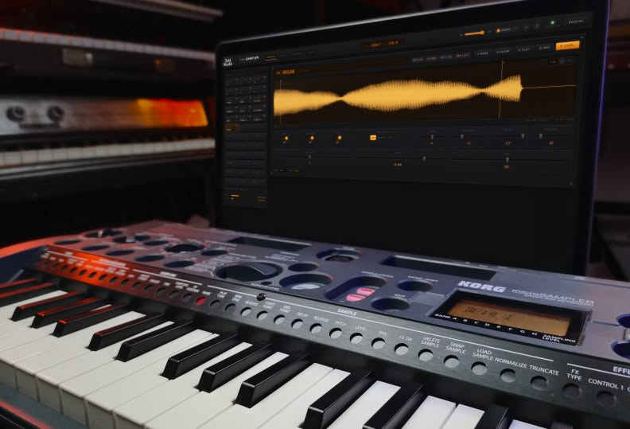

# microSAMPLER Editor / Librarian


A modern editor/librarian for the **Korg microSAMPLER**, replacing Korg's original 32-bit application (PPC/i386) that no longer runs on macOS 10.15+.
The hardware protocol was reverse-engineered from the original binary and verified against a real device.
This app covers everything the original did, plus a few things it didn't.



📖 **[Full documentation & guide →](https://benjamindehli.github.io/microsampler-editor-librarian/)**

## Download

**macOS (13+):** signed, notarized apps in a disk image, no Terminal needed:
[Apple Silicon](https://github.com/benjamindehli/microsampler-editor-librarian/releases/latest/download/microSAMPLER-macos-arm64.dmg) ·
[Intel](https://github.com/benjamindehli/microsampler-editor-librarian/releases/latest/download/microSAMPLER-macos-x86_64.dmg)
(contains the full editor as a menu-bar app plus the hardware-free **Library** app).

**Linux:** [Library AppImage](https://github.com/benjamindehli/microsampler-editor-librarian/releases/latest/download/microSAMPLER_Library-x86_64.AppImage)
(also as [tar.gz](https://github.com/benjamindehli/microsampler-editor-librarian/releases/latest/download/microSAMPLER_Library-linux-x86_64.tar.gz));
the full editor runs via the launcher in the release ZIP.

**Any platform:** the [latest release](https://github.com/benjamindehli/microsampler-editor-librarian/releases/latest) ZIP
has launchers for macOS, Linux and Windows, needing only Python 3.

## Features

- **SAMPLES**:
  - 36-slot bank overview
  - Audition on the device (honors start/end points) with a playhead on the waveform
  - On-screen keyboard mirroring the 36 pads — click to play, or tick **⌨ TYPE TO
    PLAY** to play from your computer keyboard (Z/X shift octave). A **SAMPLE /
    KEYBOARD** toggle switches between triggering one sample per key (empty keys
    dimmed) and playing the selected sample pitched across the keyboard
  - **MIDI IN** — play the device from a connected MIDI keyboard, with velocity,
    pitch bend and sustain pedal (uses the browser's Web MIDI; honors the SAMPLE /
    KEYBOARD mode)
  - WAV download/upload (auto-resample to 48/24/12/6 kHz); drop several WAVs
    onto the pads to bulk-fill consecutive slots
  - Auto-slice — chop one long sample across consecutive pads, by equal pieces
    or detected transients (great for drum breaks and loops)
  - Audio tools on upload — normalize, gain, trim silence, fade in/out,
    mono ↔ stereo (processed in-browser before transfer)
  - Filter pads by name
  - Live editing of all sample parameters
  - Draggable START/END markers on the waveform (or type exact frame values),
    with optional zero-crossing snap so trims don't click
  - Editable original BPM (the sample tempo used for BPM-sync) — re-uploads the
    sample to apply, keeping its audio and other settings
  - Zoomable / pannable waveform (scroll to zoom, drag to pan) for
    sample-accurate trimming — stereo samples show as two half-height lanes
    (left above right) so each channel reads on its own
  - Renaming banks and samples
  - All samples preload on connect — and again when you switch banks on the
    device (re-synced when you return to the app) — with progress shown, so the
    memory meter is exact and waveforms are instant
  - **FOLLOW** toggle (on by default) — the selection tracks the last sample
    triggered on the device, whether you play it or a pattern does
- **EFFECT**:
  - All 22 effect types with their full parameter sets
  - Hover any parameter to see its range and default
  - The two assignable FX knobs (panel knob movements tracked live)
  - Conditional parameter graying/swapping exactly like the hardware
- **PATTERNS**:
  - Receive all 16 patterns
  - Mini piano-roll preview + play patterns on the device (per-pattern ▶)
  - In-app **piano-roll editor** over both the sample-mode (pad) and
    keyboard-mode (pitched) tracks:
    - **Draw / Erase / Select** tools (the cursor changes to match), with
      move/resize, drag-to-erase and a marquee for multi-select
    - **Multi-select** (Shift/⌘-click), **undo/redo**, and **copy/paste** whose
      clipboard persists across patterns (copy from one, paste into another)
    - Per-note velocity shown as note brightness; arrow keys nudge or resize
    - **Space** plays/stops the pattern on the device; clicking outside the
      dialog saves and closes
    - Set the bar count, grid snap and the keyboard track's sample, then save
      back to the device (build a pattern from scratch on an empty slot, too)
  - Import and Export MIDI files
  - Remote record trigger (presses the device's [REC] over MIDI; watch the
    device screen)
- **UTILITY**:
  - Full bank backup/restore (RAM or persistent user banks)
  - Cherry-pick restore — copy a single sample out of a backup into any pad
    of the current bank
  - Remote sampling trigger (input select + [SAMPLING] over MIDI; no
    device-state readback, so watch the device screen)
- **Live two-way sync**:
  - Panel edits on the device show up in the app instantly
- **Master volume** slider for the device output, and a **panic** button
  (all sound off / stop) for stuck notes
- **12 accent themes** picked from a swatch dropdown — the whole interface
  (buttons, LCD, waveform, keys) recolours to match
- Remembers your last-open view across reloads
- Tells you when a newer release is available (checks GitHub; dismissible)
- **Library mode** (no hardware): import original Korg `.msmpl_bank` backups (or
  this app's `.zip` backups), browse and play their samples in the browser,
  export them as WAVs, and recover the recorded patterns as MIDI files — handy
  for getting audio and sequences out of old backups

## Requirements

**The desktop apps above bundle everything** (macOS 13+ / Linux x86-64) — the
requirements below apply to the classic ZIP + launchers:

- macOS (tested), Linux (should work) or Windows (untested)
- **Python 3.8+** — that's the only thing you install.
  [pyusb](https://github.com/pyusb/pyusb) (BSD) and
  [libusb](https://libusb.info/) (LGPL) are bundled in
  [`native-tools/vendor/`](native-tools/vendor/), so there's no `pip` or
  Homebrew step. (A system pyusb/libusb, if you have one installed, is used in
  preference — the bundled copies are just a fallback. A newer system libusb,
  e.g. `brew install libusb`, can be more robust across reconnects.)
- Chrome/Chromium recommended (any modern should work)
- A Korg microSAMPLER connected with USB

## Run

**Installed the apps?** Just open them — the Editor app puts a ♪ in the menu
bar and opens the editor; the Library app opens straight into the librarian.
The rest of this section is the classic ZIP way:

Open the folder for your platform — **`macOS/`**, **`Linux/`**, or **`Windows/`**
— and double-click **`microSAMPLER Editor Librarian`** (`.command` / `.sh` /
`.bat`). It starts the bridge and opens the editor in your browser automatically.
(Each folder also has a **`microSAMPLER Library`** launcher — see
[Library mode](#library-mode-no-hardware) below.)

- **macOS:** the launcher is unsigned, so the first run is blocked ("unidentified
  developer"). Approve it once: right-click (Control-click) the launcher →
  **Open** → **Open**. On newer macOS without an *Open* option, double-click once,
  then **System Settings → Privacy & Security → Open Anyway**. (Or clear the
  quarantine in a terminal: `xattr -dr com.apple.quarantine "<unzipped folder>"`.)
- **Linux:** mark the `.sh` executable / "Allow launching" first, or run
  `./'Linux/microSAMPLER Editor Librarian.sh'` from a terminal.
- **Windows:** **experimental/untested** — the device's USB driver must first be
  switched to WinUSB with [Zadig](https://zadig.akeo.ie/) so libusb can open it.

macOS and Linux ask for your password — root is required to claim the USB
interface from the OS MIDI driver.

### Manual

```bash
sudo python3 native-tools/bridge.py   # macOS/Linux (root for USB)
py -3 native-tools\bridge.py          # Windows
```

Then open http://localhost:8765

### UI development without hardware

```bash
python3 native-tools/bridge.py --mock
```

### Library mode (no hardware)

To browse and extract samples from bank backups with no microSAMPLER connected —
for example to recover audio from old `.msmpl_bank` files saved by Korg's
original editor — run the bridge in library mode:

```bash
python3 native-tools/bridge.py --library
```

Library mode serves on **http://localhost:8766** — a separate port from the
device bridge's 8765, so it never clashes with (or attaches to) a running device
bridge.
Or just double-click the **`microSAMPLER Library`** launcher in your platform's
folder (`macOS/`, `Linux/`, `Windows/`) — no password needed, since library mode
never touches USB.
Open the editor, go to **LIBRARY**, and use **OPEN BANK FILE…** to import a
`.msmpl_bank` (original Korg) or a `.zip` (this app's) backup.
You can then play each sample in the browser, download individual WAVs, or grab
the whole bank as a ZIP of WAVs.
If the bank holds recorded patterns, they're listed below the pads — download
each as a MIDI file, or all of them as a `.mid` ZIP.

To extract straight to WAVs from the command line, without the app:

```bash
python3 native-tools/msmpl_bank.py info    "my bank.msmpl_bank"   # list samples
python3 native-tools/msmpl_bank.py extract "my bank.msmpl_bank"   # -> WAVs + manifest
```

Bank backups land in `native-tools/backups/` (gitignored, they're your data).
Note that sample/parameter transfers target the device's **current bank (RAM)**; save on the device or restore to a user bank to persist.

## Repository layout

```text
macOS/ Linux/ Windows/        double-clickable launchers per OS — each has
                              "microSAMPLER Editor Librarian" (device) and
                              "microSAMPLER Library" (no-hardware librarian)
web-editor/                   the browser app (served by the bridge)
native-tools/                 Python bridge + CLI tools (libusb USB-MIDI):
  bridge.py                     HTTP/SSE server the app talks to
  download.py / upload.py       single-sample transfer CLIs
  bank.py                       full-bank backup/restore CLI
  msusb.py                      transport + diagnostics (inquiry/monitor/…)
  protocol.py                   Korg SysEx/bulk protocol (offline self-test)
  test_*.py                     offline regression suite (mock device)
tools/re/                     reverse-engineering toolkit (needs the original
                              Korg installer, not included) — regenerates
                              web-editor/functions/fxData.js etc.
tools/bundle/                 the desktop apps: PyInstaller specs + entries,
                              the Swift menu-bar shell, DMG/AppImage/notarize
                              scripts (built by workflows/package.yml)
tools/make_app_icon.sh        give the launcher its icon (run once, macOS)
```

## Development

See [ARCHITECTURE.md](ARCHITECTURE.md) for how the bridge, browser app, and
device fit together, and [CONTRIBUTING.md](CONTRIBUTING.md) to get started.

Run the offline test suite (no hardware needed):

```bash
cd native-tools
python3 protocol.py && python3 test_download.py && python3 test_upload.py \
  && python3 test_bank.py && python3 test_bridge.py
```

JavaScript unit tests for the pure modules (audio DSP + value encoders), via
Node's built-in test runner (no deps):

```bash
npm test        # node --test test/*.test.mjs
```

The app needs **no build step** to develop or run — it's plain ES modules and per-component CSS served straight from `web-editor/`.

End-to-end browser smoke (boots the mock bridge, drives the app headless, fails
on any page/console error or broken interaction):

```bash
pip install playwright && playwright install chromium
python3 e2e/smoke.py        # reuses a bridge already on the port, else starts a mock one
```

### Linting

Bug-focused linters (dev-only; not runtime dependencies) keep the no-build code
honest — they catch undefined names, unused imports, etc. CI runs both.

```bash
# Python (native-tools/ + tools/) — needs ruff (pip install ruff)
ruff check

# JavaScript (web-editor/) — needs the dev deps (npm install)
npm run lint:js
```

## Build a release

To produce a lean, minified `dist/` for publishing (JS bundled + minified, CSS merged + minified, HTML comments stripped, dev/RE/test files excluded):

```bash
npm install      # one dev-only dependency: esbuild (MIT)
npm run build    # -> dist/
sudo python3 dist/native-tools/bridge.py

npm run pack     # -> dist/ + release/microsampler-editor-librarian-vX.Y.Z.zip
```

`dist/` mirrors the run layout (`web-editor/` + `native-tools/` + launcher) and runs exactly like the source.
`esbuild` is build-time only — the app ships no runtime npm dependencies.

`npm run pack` builds `dist/` and packages it into the release ZIP under `release/`,
named to match the version (`<name>-vX.Y.Z.zip`) and the docs download link, with a
single top-level folder and the launchers kept executable. Upload that ZIP to the
GitHub release. The packer is plain Node (no `zip` binary needed).

Bumping the version with `npm version <new>` automatically stamps it into the
docs download link and structured data (the `version` lifecycle runs
`npm run stamp-version` and stages `docs/index.html` into the version commit), so
the **Download vX.Y.Z (ZIP)** button on the site always points at the matching
release asset. Run `npm run stamp-version` manually if you bump the version some
other way.

### Cutting a release

1. `npm version <new>` (stamps the docs/bridge version, commits, tags `vX.Y.Z`).
2. Push the commit and the tag.
3. Publish a GitHub release for that tag (write the notes).

Publishing triggers two workflows: **Release**
(`.github/workflows/release.yml`) attaches the source ZIP
(`microsampler-editor-librarian-vX.Y.Z.zip`), and **Package apps**
(`.github/workflows/package.yml`) builds, signs, notarizes and attaches the
macOS DMGs and the Linux AppImage + tar.gz. Both verify the tag matches
`package.json` first.

## Disclaimer

This is an **independent, unofficial project**. It is not affiliated with, endorsed, sponsored, or supported by Korg Inc.
*microSAMPLER* and *Korg* are trademarks of Korg Inc., used here only to identify the hardware this software interoperates with.

This repository contains **no Korg software, firmware, or other Korg copyrighted material**.
The communication protocol was independently reverse-engineered for the sole purpose of **interoperability** with hardware owned by the user (as permitted by, e.g., Directive 2009/24/EC art. 6 in the EU/EEA).

**Use at your own risk.** This software is provided *“as is”*, without warranty of any kind, as set out in sections 15–16 of the [GNU GPL v3](LICENSE).
The author accepts **no responsibility or liability** for any damage to your device, loss of samples, patterns or other data, or any other consequence of using this software.
It writes to the device's memory — **back up your bank** (UTILITY → BACKUP) before bulk operations, and never disconnect the device mid-transfer.

---


Made by Benjamin Dehli / Dehli Musikk (not affiliated with Korg).

Licensed under the [GNU GPL v3](LICENSE).

microSAMPLER is a trademark of Korg Inc.
